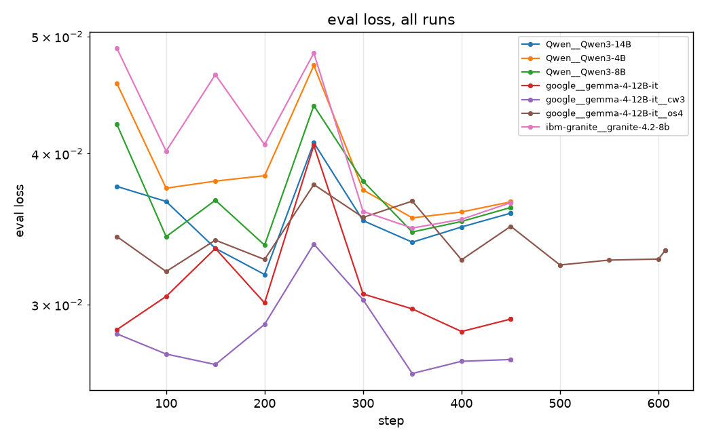
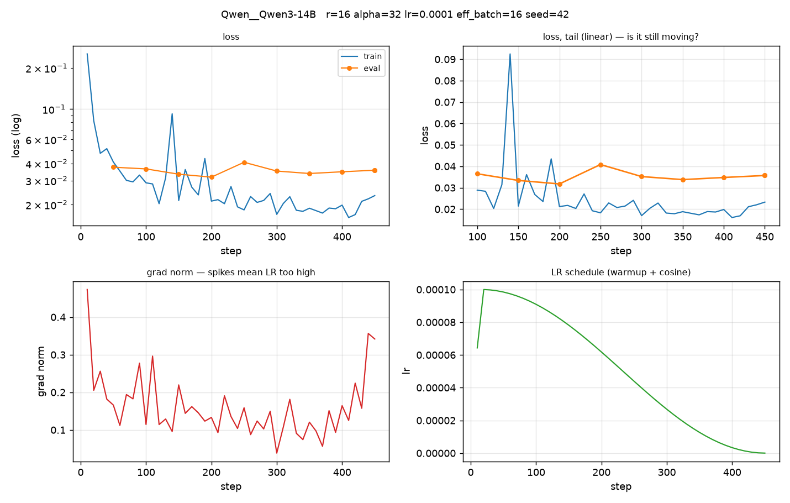
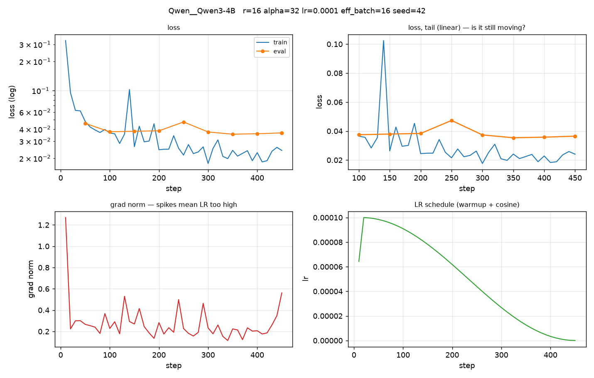
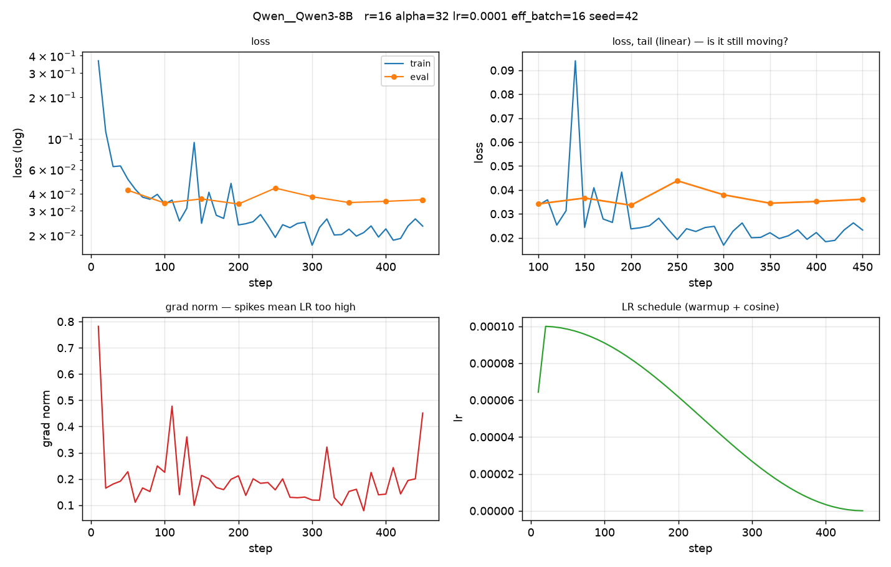
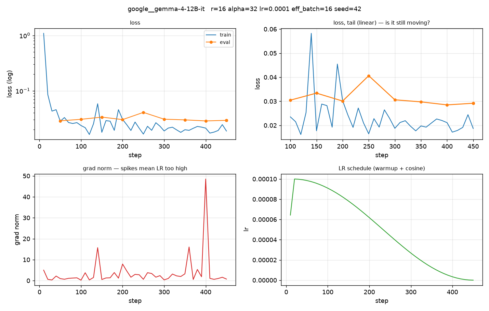
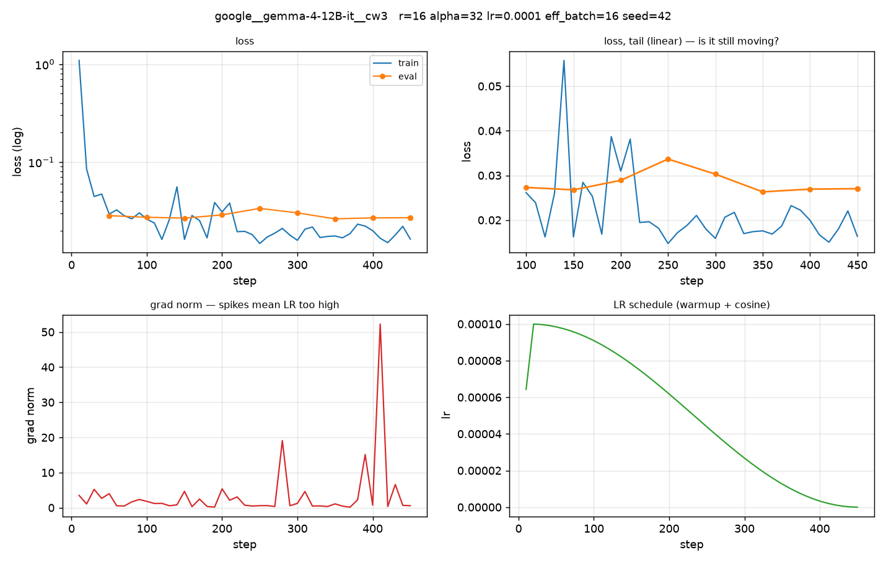
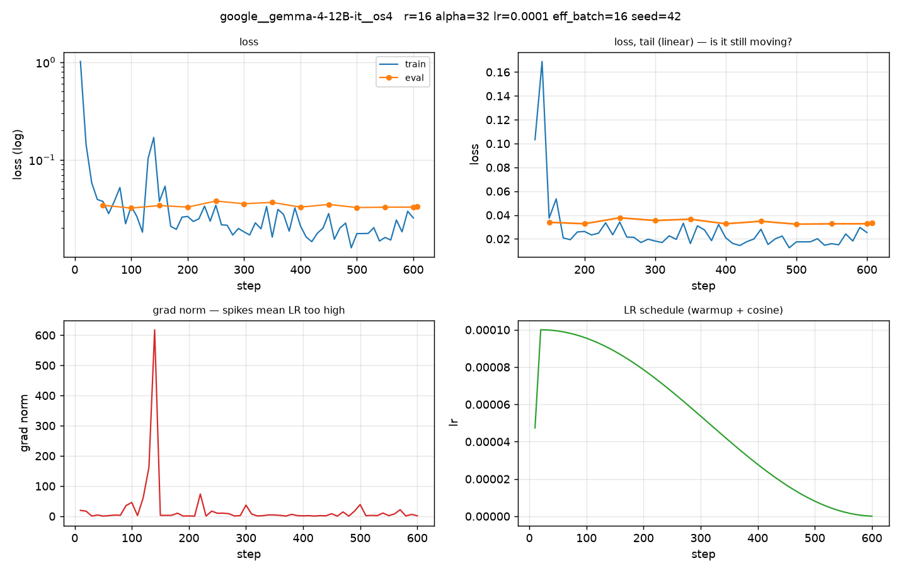
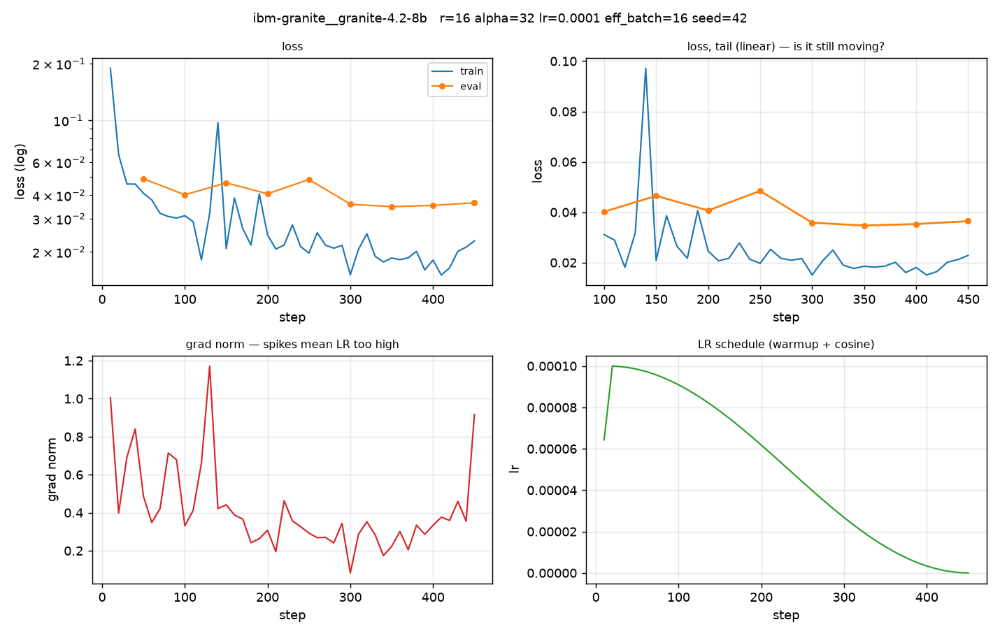

# Training diagnostics

Loss curves and the signals behind rank / batch / LR decisions.

**How to read**: loss flat at the end = converged; train≈eval and both flat
= capacity-bound, raise rank; grad-norm spikes = LR too high; high late-run

## All runs

loss variance = effective batch too small.

## Qwen__Qwen3-14B

| | |
|---|---|
| LoRA | r=16 alpha=32 dropout=0.05 |
| optim | lr=0.0001 cosine warmup=0.03 epochs=1.0 |
| batch | 1 x 16 = 16 |
| final | train 0.0329 / eval 0.0357 |
| cost | 94 min, peak 49.18 GB |

**Diagnosis**

- **convergence** — RISING at the end — overfitting or LR too high
- **rank/epochs** — eval rose 12% off its minimum — OVERFITTING, fewer epochs or lower rank
- **learning rate** — grad-norm stable (median 0.144, max 0.473)
- **batch size** — late-run loss CV 0.11 — stable

## Qwen__Qwen3-4B

| | |
|---|---|
| LoRA | r=16 alpha=32 dropout=0.05 |
| optim | lr=0.0001 cosine warmup=0.03 epochs=1.0 |
| batch | 1 x 16 = 16 |
| final | train 0.0395 / eval 0.0365 |
| cost | 49 min, peak 25.23 GB |

**Diagnosis**

- **convergence** — RISING at the end — overfitting or LR too high
- **rank/epochs** — healthy train/eval gap
- **learning rate** — grad-norm stable (median 0.233, max 1.269)
- **batch size** — late-run loss CV 0.11 — stable

## Qwen__Qwen3-8B

| | |
|---|---|
| LoRA | r=16 alpha=32 dropout=0.05 |
| optim | lr=0.0001 cosine warmup=0.03 epochs=1.0 |
| batch | 1 x 16 = 16 |
| final | train 0.0396 / eval 0.0361 |
| cost | 64 min, peak 34.64 GB |

**Diagnosis**

- **convergence** — RISING at the end — overfitting or LR too high
- **rank/epochs** — healthy train/eval gap
- **learning rate** — grad-norm stable (median 0.167, max 0.782)
- **batch size** — late-run loss CV 0.10 — stable

## google__gemma-4-12B-it

| | |
|---|---|
| LoRA | r=16 alpha=32 dropout=0.05 |
| optim | lr=0.0001 cosine warmup=0.03 epochs=1.0 |
| batch | 1 x 16 = 16 |
| final | train 0.0497 / eval 0.0292 |
| cost | 177 min, peak 58.57 GB |

**Diagnosis**

- **convergence** — RISING at the end — overfitting or LR too high
- **rank/epochs** — healthy train/eval gap
- **learning rate** — 3 grad-norm spikes >5x median — LR TOO HIGH
- **batch size** — late-run loss CV 0.11 — stable

## google__gemma-4-12B-it__cw3

| | |
|---|---|
| LoRA | r=16 alpha=32 dropout=0.05 |
| optim | lr=0.0001 cosine warmup=0.03 epochs=1.0 |
| batch | 1 x 16 = 16 |
| final | train 0.0490 / eval 0.0270 |
| cost | 176 min, peak 58.57 GB |

**Diagnosis**

- **convergence** — FLAT at the end — converged or capacity-bound
- **rank/epochs** — healthy train/eval gap
- **learning rate** — 5 grad-norm spikes >5x median — LR TOO HIGH
- **batch size** — late-run loss CV 0.13 — stable

## google__gemma-4-12B-it__os4

| | |
|---|---|
| LoRA | r=16 alpha=32 dropout=0.05 |
| optim | lr=0.0001 cosine warmup=0.03 epochs=1.0 |
| batch | 1 x 16 = 16 |
| final | train 0.0467 / eval 0.0333 |
| cost | 240 min, peak 58.57 GB |

**Diagnosis**

- **convergence** — RISING at the end — overfitting or LR too high
- **rank/epochs** — healthy train/eval gap
- **learning rate** — 13 grad-norm spikes >5x median — LR TOO HIGH
- **batch size** — late-run loss CV 0.23 — stable

## ibm-granite__granite-4.2-8b

| | |
|---|---|
| LoRA | r=16 alpha=32 dropout=0.05 |
| optim | lr=0.0001 cosine warmup=0.03 epochs=1.0 |
| batch | 1 x 16 = 16 |
| final | train 0.0311 / eval 0.0364 |
| cost | 67 min, peak 31.2 GB |

**Diagnosis**

- **convergence** — RISING at the end — overfitting or LR too high
- **rank/epochs** — healthy train/eval gap
- **learning rate** — grad-norm stable (median 0.352, max 1.172)
- **batch size** — late-run loss CV 0.12 — stable

