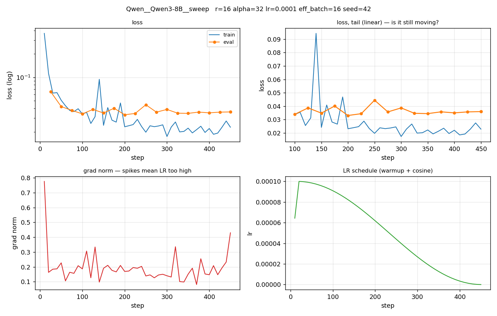

# Training diagnostics

Loss curves and the signals behind rank / batch / LR decisions.

**How to read**: loss flat at the end = converged; train≈eval and both flat
= capacity-bound, raise rank; grad-norm spikes = LR too high; high late-run

## All runs

loss variance = effective batch too small.

## Qwen__Qwen3-8B__sweep

| | |
|---|---|
| LoRA | r=16 alpha=32 dropout=0.05 |
| optim | lr=0.0001 cosine warmup=0.03 epochs=1.0 |
| batch | 1 x 16 = 16 |
| final | train 0.0397 / eval 0.0360 |
| cost | 68 min, peak 34.64 GB |

**Diagnosis**

- **convergence** — RISING at the end — overfitting or LR too high
- **rank/epochs** — healthy train/eval gap
- **learning rate** — grad-norm stable (median 0.172, max 0.776)
- **batch size** — late-run loss CV 0.11 — stable

